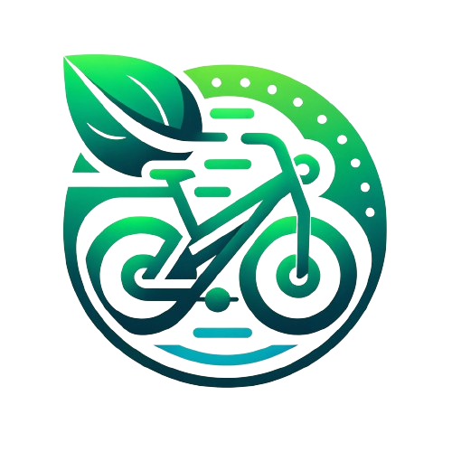

  
   

  <h1><b>BelliBikes</b></h1>

<!-- TABLA DE CONTENIDO -->

# 📗 Tabla de contenidos

- [📖 Sobre el proyecto](#sobre-el-proyecto)
  - [🛠 Desarrollado con](#built-with)
    - [:battery: Pila tecnológica](#tech-stack)
    - [:bulb: Características principales](#key-features)
  - [🚀 Demostración en directo](#live-demo)
- [💻 Servicios](#services-documentation)
  - [React](#react-client-documentation)
  - [React Mantenimiento](#maintenance-client-documentation)
  - [Django](#django)
  - [Fastify](#fastify)
  - [Express - Resend](#express-resend)
  - [Facturascripts](#facturascripts)
  - [Arduino](#arduino)
- [👥 Desarrolladores](#authors)
<!-- - [🔭 Future Features](#future-features)
- [🤝 Contributing](#contributing)
- [⭐️ Show your support](#support) -->
- [🙏 Agradecimientos](#acknowledgements)
<!-- - [❓ FAQ (OPTIONAL)](#faq)
- [📝 License](#license) -->

<!-- SOBRE EL PROYECTO -->

# 📖 BelliBikes 

**BelliBikes** es una aplicación enfocada al alquiler de bicicletas eléctricas, fomentando la facilidad en la gestión y mantenimiento y una gran experiencia para el usuario.

## 👥 Autores 

👤 **Miguel Vidal Bellido**

- GitHub: [@miguelvidalbellido](https://github.com/miguelvidalbellido)
- Gmail: [miguel.vidal.bell@gmail.com](mailto:miguel.vidal.bell@gmail.com)
- LinkedIn: [LinkedIn](https://www.linkedin.com/in/miguelvidalbellido/)

## 🛠 Desarrollado con 

### Pila tecnológica 

  
Cliente

  <ul>
    <li><a href="https://reactjs.org/">React.js</a></li>
  </ul>

  
Servidor

  <ul>
    <li><a href="https://expressjs.com/">Express.ts</a></li>
    <li><a href="https://fastify.dev/">Fastify.js</a></li>
    <li><a href="https://www.djangoproject.com/">Django</a></li>
    <li><a href="https://www.arduino.cc/">Arduino</a></li>
    <li><a href="https://www.php.net/">PHP</a></li>
    <li><a href="https://facturascripts.com/">Facturascripts</a></li>
  </ul>

Bases de Datos

  <ul>
    <li><a href="https://www.postgresql.org/">PostgreSQL</a></li>
    <li><a href="https://www.mysql.com/">PostgreSQL</a></li>
    <li><a href="https://www.sqlite.org/">SQLite</a></li>
  </ul>

Gestores de Bases de Datos

  <ul>
    <li><a href="https://www.pgadmin.org/">PgAdmin</a></li>
    <li><a href="https://www.adminer.org/">Adminer</a></li>
  </ul>

Otras tecnologías

  <ul>
    <li><a href="https://contabo.com/en/">Docker Compose</a></li>
    <li><a href="https://resend.com/">Resend</a></li>
    <li><a href="https://bitwarden.com/es-la/">Bitwarden</a></li>
    <li><a href="https://www.nginx.com/">Nginx</a></li>
    <li><a href="https://letsencrypt.org/es/">LetsEncrypt</a></li>
    <li><a href="https://www.ionos.es/">Ionos</a></li>
    <li><a href="https://docs.docker.com/compose/">Contabo</a></li>
  </ul>

<!-- CARACTERRÏSTICAS -->

### Características principales 

- **Micro servicio con plantillas para enviar correos**
- **Comunicación interactiva mediante WebSocket**
- **Cliente React con dos vistas, vista cliente para móvil y vista ordenador para información y panel de administración.**
- **Panel de Mantenimiento con React.**
- **Facturación con ERP (Facturascripts)**
- **Despliegue con Docker-compose en servidor VPS con HTTPS**

(<a href="#readme-top">volver al inicio</a>)

<!-- LIVE DEMO -->

## 🚀 Demostración en directo 

- [Cliente](https://bellibikes.bellidel.eu/)
- [Mantenimiento](https://bellibikesmant.bellidel.eu/login)
- [Facturación](https://bbfs.bellidel.eu/)

(<a href="#readme-top">volver al inicio</a>)

# Servicios 

## :wrench: Servicios Frontend 

### 🖥️ Cliente React  
BelliBikes ofrece una experiencia de usuario adaptativa y rica en funcionalidades, distribuida en dos vistas principales diseñadas para satisfacer las necesidades específicas de nuestros usuarios, dependiendo del dispositivo que estén utilizando. A continuación, se detallan las capacidades y características de cada vista.

#### 📱 Vista Cliente Móvil

Diseñada **específicamente para dispositivos móviles**, esta vista se centra en facilitar el proceso de alquiler de bicicletas, ofreciendo una interfaz intuitiva y accesible que se activa automáticamente al detectar el acceso desde un dispositivo móvil.

**Funcionalidades Principales:**

- **Registro y Login:** Los usuarios pueden crear una cuenta nueva o iniciar sesión en una existente. :pencil:

- **Alquiler y Devolución de Bicicletas:** Facilita el proceso de alquilar una bicicleta y devolverla, optimizando la experiencia para dispositivos móviles. :bicycle:

- **Contratación de Planes:** Permite a los usuarios contratar diferentes planes de alquiler según sus necesidades. :page_with_curl:

- **Consulta de Información sobre Estaciones:** Ofrece información detallada sobre las estaciones de bicicletas, incluyendo ubicación y disponibilidad. :station:

- **Notificación de Incidencias:** Los usuarios pueden notificar incidencias directamente desde la aplicación. :loudspeaker:

- **Consulta de Etapas de Incidencias:** Permite a los usuarios seguir el progreso de las incidencias que han notificado. :mag_right:

- **Consulta de Perfil:** Los usuarios pueden ver y editar su perfil, incluyendo información personal y preferencias. :bust_in_silhouette:

#### 💻 Vista PC - Web Informativa y Panel de Administración
Esta vista está diseñada para ser utilizada principalmente en computadoras. Incluye una web informativa accesible a todos los usuarios, y un panel de administración destinado a la gestión integral de la aplicación.

**Web Informativa:**

- Proporciona información general sobre BelliBikes, incluyendo servicios y ventajas. :information_source:
- Los usuarios logueados pueden comprar planes de alquiler directamente desde esta vista. :shopping_cart:

**Panel de Administración:**

- **CRUD de Bicicletas, Estaciones, Slots e Incidencias:** Herramientas completas para la gestión de bicicletas, estaciones de alquiler, slots disponibles e incidencias reportadas. :wrench:

- **Mapa Interactivo:** Visualización de estaciones activas e inactivas para facilitar la gestión y mantenimiento. :world_map:

- **Estadísticas Detalladas:** Análisis y seguimiento de la utilización de bicicletas, disponibilidad de slots y estado de las estaciones. :bar_chart:

- **Gestión de Usuarios:** Permite a los administradores enviar correos personalizados a usuarios, modificar datos de usuario y controlar el acceso de los usuarios activando o desactivando su capacidad de login. :user_cog:

Cada vista está diseñada con el usuario final en mente, asegurando que la experiencia de alquilar una bicicleta sea tan eficiente y agradable como sea posible, mientras que la gestión y mantenimiento de la aplicación se realizan con facilidad desde el panel de administración.

### :wrench: Cliente React para Mantenimiento 

El cliente React para el usuario de mantenimiento es una herramienta esencial dentro del ecosistema de BelliBikes, diseñada para facilitar la gestión, seguimiento y resolución de incidencias de manera eficiente. Al acceder a la aplicación, se realizan las siguientes comprobaciones y funcionalidades:

#### :lock: Autenticación y Token
- Al acceder, la aplicación verifica la existencia de un token de autenticación.
- Si no se encuentra un token, se carga automáticamente el módulo de **login** para que el usuario de mantenimiento inicie sesión.

#### :bar_chart: Estadísticas
- **Sección de Estadísticas:** Una vez autenticado, el usuario puede acceder a una sección dedicada a las estadísticas.
- **Visualización Gráfica y Datos Estadísticos:** Se presentan gráficos y estadísticas detalladas sobre las incidencias, permitiendo al usuario obtener una visión general del estado actual y tendencias en el tiempo.

#### :clipboard: Listado de Incidencias
- **Visualización de Incidencias:** Se ofrece un listado completo de todas las incidencias reportadas.
- **Detalle de Incidencias:** Los usuarios pueden seleccionar una incidencia específica para ver sus etapas y detalles asociados, facilitando el seguimiento y la gestión de cada caso.

#### :mag: Escáner de RFID
- **Asociación de Escáner:** Para los usuarios de mantenimiento sin un escáner RFID asociado, se muestra un modal que permite la asociación de un escáner a su cuenta.
- **Modo Escaneo:** Una vez asociado el escáner, el usuario puede entrar en modo escucha al presionar el botón de escanear.
- **Lectura de Productos:** Cuando el usuario de mantenimiento escanea un producto (bicicleta) con su lector RFID, la aplicación notifica al backend, que a su vez informa al frontend sobre la bicicleta escaneada.
- **Gestión de Incidencias y Etapas:** Se muestran las incidencias y etapas asociadas a la bicicleta leída, y el usuario tiene la posibilidad de añadir nuevas etapas a la incidencia, mejorando el proceso de resolución.

El cliente para el usuario de mantenimiento está diseñado para ser intuitivo y eficiente, asegurando que la gestión de incidencias y el mantenimiento de las bicicletas se realicen con la máxima eficacia y el menor tiempo de respuesta posible.

(<a href="#readme-top">volver al inicio</a>)

<!-- DEPENDENCIAS -->
## :package: Dependencias de React Frontend

### :star: Dependencias Principales

- **@radix-ui/react-***: :art: Colección de componentes de UI sin estilo para construir interfaces de usuario de alta calidad.
- **axios**: :globe_with_meridians: Cliente HTTP basado en promesas para el navegador y node.js.
- **class-variance-authority**: :bookmark_tabs: Proporciona tipos de utilidad para manejar variantes de clase en TypeScript.
- **clsx**: :link: Utilidad para construir cadenas de nombres de clase condicionalmente.
- **date-fns**: :calendar: Biblioteca moderna de manipulación de fechas.
- **framer-motion**: :dizzy: Biblioteca para animaciones y gestos en React.
- **html5-qrcode**: :qr_code: Lector de QR para HTML5.
- **lucide-react**: :pushpin: Iconos React para Lucide.
- **react y react-dom**: :atom_symbol: Biblioteca de JavaScript para construir interfaces de usuario.
- **react-day-picker**: :date: Selector de fechas flexible y sin dependencias para React.
- **react-device-detect**: :mobile_phone_off: Detecta dispositivos, navegadores y sistemas operativos en React.
- **react-helmet-async**: :helmet_with_white_cross: Gestión de documentos head para React.
- **react-hook-form**: :memo: Biblioteca para manejar formularios con React.
- **react-leaflet**: :world_map: Componentes React para Leaflet, una biblioteca de mapas.
- **react-lottie**: :film_projector: Renderizador de animaciones Lottie para React.
- **react-native-qrcode-scanner y react-qr-reader**: :camera_flash: Bibliotecas para escanear códigos QR en aplicaciones React y React Native.
- **react-router-dom**: :compass: Enrutamiento dinámico para aplicaciones web con React.
- **react-toastify**: :bell: Componentes de notificación para React.
- **tailwind-merge y tailwindcss-animate**: :cyclone: Herramientas para trabajar con Tailwind CSS, una biblioteca de CSS de utilidad.

### :gear: DevDependencies

- **@types/react y @types/react-dom**: :page_facing_up: Tipos TypeScript para react y react-dom.
- **@vitejs/plugin-react**: :electric_plug: Plugin oficial de Vite para React.
- **autoprefixer**: :mag: PostCSS plugin para parsear CSS y agregar prefijos de proveedores a las reglas CSS.
- **eslint y plugins relacionados**: :no_entry_sign: Linter para JavaScript y JSX, con plugins específicos para React y hooks.
- **postcss**: :nail_care: Herramienta para transformar CSS con plugins de JavaScript.
- **tailwindcss**: :tornado: Marco CSS de utilidad para el diseño rápido de UI.
- **vite**: :rocket: Herramienta de construcción que ofrece una experiencia de desarrollo más rápida y un servidor de desarrollo optimizado.

<!-- AGRADECIMIENTOS -->

## :package: Dependencias del Dashboard de Mantenimiento

### :sparkles: Dependencias Principales

- **axios**: :globe_with_meridians: Cliente HTTP basado en promesas para el navegador y node.js.
- **chart.js y react-chartjs-2**: :bar_chart: Bibliotecas para crear gráficos interactivos dentro de aplicaciones React.
- **react y react-dom**: :atom_symbol: Bibliotecas de JavaScript para construir interfaces de usuario.
- **react-hot-toast**: :fire: Biblioteca para mostrar notificaciones de una manera muy sencilla.
- **react-icons**: :art: Permite incluir íconos de diferentes librerías en proyectos React.
- **react-lottie**: :film_projector: Renderizador de animaciones Lottie para React.
- **react-router-dom**: :compass: Enrutamiento dinámico para aplicaciones web con React.

### :gear: DevDependencies

- **@types/react y @types/react-dom**: :page_facing_up: Tipos TypeScript para react y react-dom.
- **@vitejs/plugin-react**: :electric_plug: Plugin oficial de Vite para React.
- **autoprefixer y postcss**: :nail_care: Herramientas para automatizar la compatibilidad de CSS entre diferentes navegadores.
- **eslint y plugins relacionados**: :no_entry_sign: Linter para JavaScript y JSX, con plugins específicos para React y hooks.
- **tailwindcss**: :cyclone: Marco CSS de utilidad para el diseño rápido de UI.
- **vite**: :rocket: Herramienta de construcción que ofrece una experiencia de desarrollo más rápida y un servidor de desarrollo optimizado.

## 🙏 Agradecimientos 

En primer lugar, mi gratitud hacia el equipo docente de primero y segundo curso. Cada profesor, con su dedicación, pasión y compromiso, no solo ha compartido con nosotros valiosos conocimientos técnicos, sino que también nos ha enseñado a enfrentar desafíos, a trabajar en equipo y a nunca dejar de aprender y curiosear sobre las infinitas posibilidades que el desarrollo web ofrece. Su guía ha sido fundamental para el desarrollo de este proyecto y para prepararnos para los retos profesionales que nos esperan.

Quiero agradecer especialmente a Yolanda, Carolina, Javi, Pau, Miguel, Jose y Javi, por su apoyo continuo, sus consejos y su capacidad para inspirarnos a superar nuestras expectativas. Su entusiasmo y conocimiento han sido una fuente de inspiración constante y han jugado un papel crucial en mi formación.

Este proyecto es el resultado de muchas horas de esfuerzo, aprendizaje y colaboración. Es un reflejo no solo de mi trabajo, sino del espíritu de comunidad y apoyo mutuo que he tenido la fortuna de experimentar en este ciclo formativo. Por ello, mi agradecimiento se extiende a todos mis compañeros, con quienes he compartido dudas, ideas y descubrimientos a lo largo del camino. Su compañerismo ha hecho de esta experiencia algo inolvidable.

Este proyecto no solo marca el fin de una etapa, sino el comienzo de una nueva aventura profesional. Gracias a todos los que han sido parte de este viaje.

(<a href="#readme-top">volver al inicio</a>)

